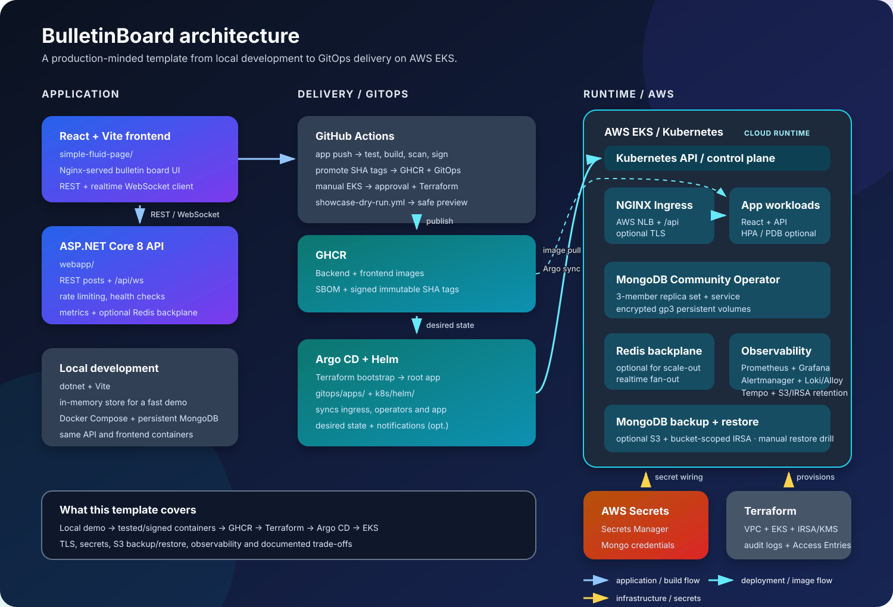
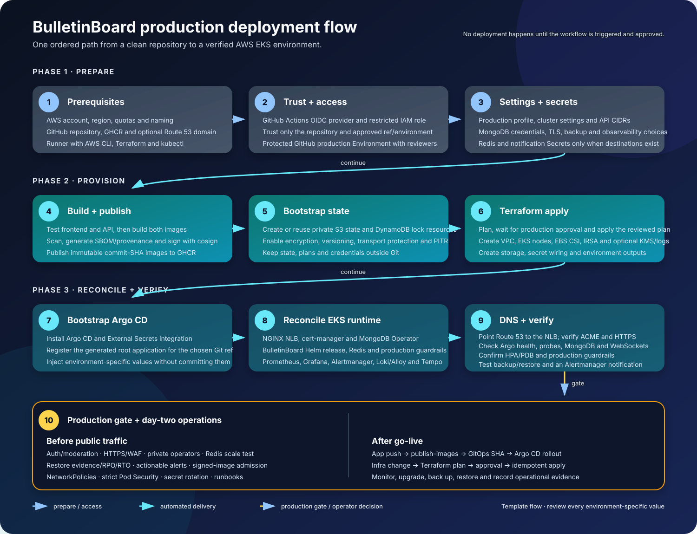

# BulletinBoard

BulletinBoard is a small full-stack demo built to show how an application moves from local development to a cloud-native deployment. It combines a React/Vite frontend, an ASP.NET Core 8 API and MongoDB with Docker, Kubernetes, Helm, GitOps and AWS infrastructure automation.

The project is intentionally educational. The interesting part is the delivery path around the application — not a claim that this is a production-ready public message board.

## What this project demonstrates

- A React frontend served through Nginx.
- A minimal ASP.NET Core API backed by MongoDB.
- Reproducible local development with Docker Compose.
- Container images published to GitHub Container Registry.
- Kubernetes packaging with Helm.
- GitOps deployment with Argo CD.
- External secret synchronization from AWS Secrets Manager.
- AWS networking and EKS provisioned with Terraform.
- Health checks, rate limiting and Prometheus-compatible application metrics.
- Optional Redis pub/sub for realtime updates across multiple API replicas.
- Persistent MongoDB replica set storage and an opt-in S3 backup/restore drill.
- An opt-in production observability profile with Prometheus, Grafana,
  Alertmanager, Loki, Grafana Alloy and Tempo.
- Secret-safe examples and a documented security policy.





## Recommended path: local Compose first, then EKS

The recommended path is:

1. Run the application locally with Docker Compose.
2. Review the Helm chart and render it locally.
3. Use `infrastructure/eks/` for the EKS infrastructure track.
4. Use `gitops/` and Argo CD to deploy the application.

## Run locally

There are two local modes. The in-memory mode is the quickest way to preview the application and does not require MongoDB. The MongoDB mode is useful when you want persistence between API restarts.

### In-memory mode

Run the API with its development in-memory store:

```sh
cd webapp
dotnet run --no-launch-profile --urls http://127.0.0.1:8080
```

In another terminal, start the frontend:

```sh
cd simple-fluid-page
npm ci
npm run dev
```

Open [http://localhost:5173](http://localhost:5173). The API is proxied through the frontend at `/api`; it is also exposed directly at [http://localhost:8080](http://localhost:8080). The in-memory store starts empty and resets when the API stops. New posts are delivered to open clients in real time through the `/api/ws` WebSocket endpoint.

### MongoDB mode with Docker Compose

For the full local stack with MongoDB persistence:

```sh
cp .env.example .env
# Edit .env and set a local-only value for MONGO_ROOT_PASSWORD.
# Change POST_STORAGE from inmemory to mongodb.
docker compose up --build
```

Open [http://localhost:8081](http://localhost:8081). Compose starts the frontend, API and MongoDB together. The copied `.env` file is ignored by Git and must never be committed.

Useful local checks:

```sh
cd simple-fluid-page
npm ci
npm run lint
npm run build

cd ../
dotnet build webapp/BulletinBoard.csproj
dotnet test tests/BulletinBoard.Tests/BulletinBoard.Tests.csproj
```

## Repository layout

| Path | Purpose |
| --- | --- |
| `simple-fluid-page/` | React/Vite frontend and Nginx configuration |
| `webapp/` | ASP.NET Core API |
| `tests/` | API validation tests |
| `k8s/helm/bulletinboard/` | Helm chart for the application |
| `gitops/` | Argo CD, MongoDB Operator and External Secrets resources |
| `gitops/observability/` | Grafana dashboard and production observability profile documentation |
| `infrastructure/eks/` | AWS/EKS infrastructure and bootstrap track |
| `.github/workflows/mongodb-restore-drill.yml` | Approved, manual MongoDB backup verification |
| `gitops/redis/` | Optional Redis realtime backplane guidance |
| `docker-compose.yml` | Local development stack |
| `docs/architecture.svg` | High-level architecture diagram |
| `docs/deployment-flow.svg` | Numbered setup, verification and operations flow |

## Kubernetes and secrets

The Helm chart deliberately does not create database credentials from values. It expects a Secret named `mongo-root-secret` with `username` and `password` keys. In the EKS path, Terraform creates the AWS Secrets Manager container and bootstraps External Secrets to provision that Kubernetes Secret. The actual credential value is added outside Terraform so it never enters Git or Terraform state.

Environment-specific values are supplied through Terraform variables and AWS Secrets Manager. Keep those values out of Git.

Never commit `.env`, Terraform variable files, Terraform state or plans, kubeconfigs, private keys or rendered Kubernetes Secrets. See [SECURITY.md](SECURITY.md) for the secret-handling policy.

### Kubernetes/AWS prerequisites

The Kubernetes files are a deployment showcase and are not a hosted environment by themselves. To use them against AWS, you must provide and configure:

- An AWS account, region, profile and IAM permissions for Terraform, EKS, networking, load balancing and Secrets Manager.
- Docker, AWS CLI, Terraform and `kubectl` on the operator machine. Terraform uses `kubectl` once to bootstrap Argo CD after EKS is ready.
- An EKS cluster and kubeconfig, or the `infrastructure/eks/` track to provision one.
- A Git repository containing this `gitops/` path, reachable by the cluster. Set `gitops_repository_url` when using a fork.
- Container images in GHCR (or another registry) and matching image tags in `k8s/helm/bulletinboard/values.yaml`.

The repository includes a GitHub Actions workflow at `.github/workflows/publish-images.yml` that builds and publishes both images to GHCR when changes are pushed to `main`. It uses the workflow's short-lived `GITHUB_TOKEN`; the published images must be public unless the Helm chart is extended with registry credentials. A typical manual flow is:

```sh
export IMAGE_TAG="$(git rev-parse --short HEAD)"
docker build -t ghcr.io/luunomx/bulletinboard-backend:"$IMAGE_TAG" ./webapp
docker build -t ghcr.io/luunomx/bulletinboard-frontend:"$IMAGE_TAG" ./simple-fluid-page

# GHCR_TOKEN must come from a local secret store or environment variable.
echo "$GHCR_TOKEN" | docker login ghcr.io -u "$GITHUB_USER" --password-stdin
docker push ghcr.io/luunomx/bulletinboard-backend:"$IMAGE_TAG"
docker push ghcr.io/luunomx/bulletinboard-frontend:"$IMAGE_TAG"
```

For the EKS infrastructure track, work from `infrastructure/eks/`: copy `terraform.tfvars.example` to `terraform.tfvars` and `backend.hcl.example` to `backend.local.hcl`, review `terraform plan`, and only then apply it. Terraform and AWS resources can incur charges; destroy unused environments when finished.

The preferred EKS flow is now a single Terraform apply. It provisions the AWS infrastructure, creates the least-privilege IRSA role for External Secrets, creates the empty Secrets Manager container, bootstraps Argo CD and registers the root application:

```sh
cd infrastructure/eks
cp terraform.tfvars.example terraform.tfvars
cp backend.hcl.example backend.local.hcl
terraform init -backend-config=backend.local.hcl
terraform plan
terraform apply
```

Before the first sync completes, populate the secret value created by Terraform. The value is intentionally kept outside Terraform state:

```sh
SECRET_NAME="$(terraform output -raw mongodb_secret_name)"
aws secretsmanager put-secret-value \
  --secret-id "$SECRET_NAME" \
  --secret-string '{"username":"root","password":"replace-me"}'
```

Terraform then bootstraps Argo CD. Argo CD installs the NGINX Ingress Controller, External Secrets Operator, MongoDB Community Operator, the persistent MongoDB replica set and the BulletinBoard Helm release. The generated ExternalSecret uses the Terraform region and secret name, so no AWS account, role ARN or secret-name placeholder is committed to Git.

For a fork or another Git revision, set `gitops_repository_url` and `gitops_revision` in the ignored `terraform.tfvars` file. The cluster's public hostname and optional TLS settings remain Helm environment configuration.

Set `enable_mongodb_backup = true` to add a private, encrypted and versioned S3 bucket plus a daily backup CronJob. Terraform gives the backup and restore jobs a bucket-scoped IRSA role; it does not give them general AWS credentials. The suspended `mongodb-restore-drill` job verifies the newest archive with `mongorestore --dryRun`. The GitHub Actions restore workflow starts that job only after the `production` Environment approval.

### Production-minded controls

The default values keep the demo inexpensive and simple: one API replica and no external Redis dependency. For a hosted environment, the template also provides:

- `/health/live` and `/health/ready` endpoints for Kubernetes probes.
- A fixed-window write limit of 30 post/delete operations per minute and IP.
- `/metrics` plus an optional `ServiceMonitor` for Prometheus Operator.
- Optional `RESET_API_KEY` protection for destructive reset/delete endpoints.
- Optional Redis pub/sub through `REDIS_CONNECTION_STRING` when the API is scaled above one replica.
- Optional cert-manager/Route53 TLS on the Ingress and HPA/PDB resources, all disabled until the environment is configured.
- A three-member MongoDB Community replica set with encrypted `gp3` persistent volumes.
- Optional S3 backups with retention, versioning, public-access blocking and a manual restore drill.
- Optional Argo CD Notifications webhook templates, with webhook credentials kept in a Kubernetes Secret.
- Optional secret-backed Alertmanager webhook delivery through `ENABLE_ALERTMANAGER_NOTIFICATIONS` and `ALERTMANAGER_SECRET_NAME`.
- Optional Prometheus/Grafana/Alertmanager, Loki/Alloy and Tempo profile. Loki and Tempo use private S3 buckets with dedicated IRSA roles; Grafana uses persistent storage and is internal-only by default.
- `terraform.tfvars.production.example` provides a reviewable starting point for the hosted profile: TLS, backups, observability, KMS-backed EKS Secrets encryption, control-plane logs, restricted API access and EKS Access Entries.
- `production_profile = true` adds non-root application pods, frontend redundancy with HPA/PDB, a namespace ResourceQuota/LimitRange, Pod Security audit/warn labels and a one-time generated reset Secret. Backend scale-out remains opt-in until a shared Redis/Valkey Secret is supplied.

The backup jobs are not created unless `enable_mongodb_backup` is enabled. A PVC inside the same cluster is not a disaster-recovery backup by itself.

To enable the production observability profile, set `enable_observability = true` in the ignored Terraform variables file. The bootstrap creates the S3 buckets, IRSA service accounts and one-time Grafana admin Secret, then registers the pinned Helm releases in Argo CD. The profile automatically enables the BulletinBoard API `ServiceMonitor`, loads the overview dashboard and installs baseline availability alerts. Grafana remains a ClusterIP service; use the documented port-forward until an authenticated private access path is configured. See [`gitops/observability/README.md`](gitops/observability/README.md).

## API

- `GET /api/posts` — list posts.
- `POST /api/posts` — create a post with `name` and `message`.
- `DELETE /api/posts/{id}` — delete a post.
- `DELETE /api/posts` — reset the board; protect it with `RESET_API_KEY` in hosted environments.
- `GET /health/live` and `GET /health/ready` — liveness/readiness checks.
- `GET /metrics` — Prometheus text metrics.

The API has no user-account authentication or moderation workflow; display names are labels, not verified identities. Do not expose it to an untrusted public audience without adding an identity provider and content controls. TLS, Redis, backup destinations and observability storage also require environment-specific configuration.

## CI/CD showcase

The repository includes four complementary workflows:

- `.github/workflows/publish-images.yml` runs on application changes, tests, builds, scans, signs and publishes both images to the current repository owner's GHCR namespace, updates Helm/GitOps references and lets Argo CD sync the new release. It is also reusable by the provisioning workflow.
- `.github/workflows/provision-and-deploy.yml` is the single-trigger EKS path. It can first build/promote the current application, bootstraps the Terraform state backend, runs Terraform for a new or existing cluster, waits for the `production` environment approval and bootstraps Argo CD.
- `.github/workflows/mongodb-restore-drill.yml` starts the suspended S3 restore verification job after a separate `production` Environment approval.
- `.github/workflows/showcase-dry-run.yml` validates the delivery chain without AWS credentials, registry writes or cluster changes.

To enable `provision-and-deploy.yml`, configure these repository variables/secrets:

- `AWS_REGION`, `CLUSTER_NAME`, `CLUSTER_VERSION` and optionally `MONGODB_SECRET_NAME` as variables.
- For automatic TLS, set `ENABLE_CERT_MANAGER_TLS=true`, `ROUTE53_HOSTED_ZONE_ID`, `TLS_HOST` and `ACME_EMAIL` as variables.
- For S3 backups, set `ENABLE_MONGODB_BACKUP=true`, optionally `MONGODB_BACKUP_BUCKET_NAME`, and optionally `MONGODB_BACKUP_RETENTION_DAYS` as variables.
- For the observability profile, set `ENABLE_OBSERVABILITY=true`, optionally `OBSERVABILITY_LOGS_BUCKET_NAME`, `OBSERVABILITY_TRACES_BUCKET_NAME` and `OBSERVABILITY_RETENTION_DAYS` as variables.
- For the hosted profile, set `DEPLOYMENT_PROFILE=production`, `PRODUCTION_PROFILE=true`, `ENABLE_EKS_SECRETS_ENCRYPTION=true`, the `CLUSTER_ENDPOINT_*` variables and `CLUSTER_PUBLIC_ACCESS_CIDRS` to a runner/VPN egress CIDR. Enable all three production dependencies—TLS, backups and observability—before treating the environment as a production candidate. The complete starting point is `infrastructure/eks/terraform.tfvars.production.example`.
- Optionally set `CLUSTER_ENABLED_LOG_TYPES` as a comma-separated list and `CLUSTER_ACCESS_ENTRIES_JSON` as a Terraform-compatible JSON object for control-plane logging and EKS operator access entries. The production tfvars example is easier to review for complex access mappings.
- Set `ENABLE_REDIS_REALTIME=true` and `REDIS_SECRET_NAME` only after the shared Redis/Valkey connection Secret exists in the `bulletinboard` namespace; this is the gate for backend replicas above one.
- Set `ENABLE_ARGOCD_NOTIFICATIONS=true` only after creating `argocd-notifications-secret` in the `argocd` namespace with a `webhook-url` key.
- Set `ENABLE_ALERTMANAGER_NOTIFICATIONS=true` only after creating the named Alertmanager Secret in the `observability` namespace with a `webhook-url` key.
- `AWS_ROLE_ARN`, `TF_STATE_BUCKET` and `TF_LOCK_TABLE` as secrets.
- `MONGODB_SECRET_JSON` as a secret containing `{"username":"...","password":"..."}` when the MongoDB secret is new or should be rotated.

There is one unavoidable one-time bootstrap outside the workflow: create the AWS IAM OIDC provider and an IAM role whose trust policy is restricted to this GitHub repository/ref, then store that role ARN as `AWS_ROLE_ARN`. That role must be allowed to create the Terraform state bucket/lock table and the AWS resources in `infrastructure/eks/`. A workflow cannot create the first AWS identity it needs to authenticate with AWS.

The provisioning workflow uses GitHub OIDC for AWS access; it does not require a long-lived AWS access key in GitHub. The state bucket and lock table are created idempotently by `infrastructure/eks/scripts/bootstrap-state.sh` before Terraform initializes its remote backend. The `production` GitHub Environment should have required reviewers configured before enabling real AWS deployments. After the first run, application pushes only run the image/promotion workflow; Argo CD reconciles the changed Helm revision in the existing cluster. Terraform and AWS resources can incur charges, so keep the provisioning workflow manually triggered and destroy unused environments.

The default EKS version is `1.36`. For an already-managed cluster, set `CLUSTER_VERSION` to its current version first and upgrade one minor version at a time according to AWS EKS lifecycle rules. The provisioning workflow automatically reuses an existing MongoDB secret; for a new secret, `MONGODB_SECRET_JSON` is required so the first run does not leave a half-configured application. TLS, backups and notifications are disabled by default because their destinations are environment-specific. A private-only EKS API endpoint requires the provisioning runner to have network access to the VPC; a GitHub-hosted runner normally needs a restricted public endpoint or a self-hosted runner.

The dry-run workflow is deliberately safe for a public showcase:

- It has `contents: read` permissions only.
- It runs frontend lint/build, API tests, EKS Terraform validation and Helm rendering.
- It builds both container images on the temporary runner but never logs in to GHCR or pushes them.
- Its final delivery step only prints what publishing and Argo CD synchronization would do.
- It has no AWS credentials, Kubernetes context, registry token, `terraform apply`, `kubectl apply` or automatic `push` trigger.

The publish workflow only creates, scans and signs container images and updates the Helm image tags; it does not create cloud resources or change a Kubernetes cluster. The provisioning workflow is the only workflow with AWS apply capability, and it is manually triggered. The restore workflow only starts a suspended in-cluster verification job. The showcase workflow is a separate dry run and does not publish or deploy anything.

## License

The application and infrastructure code in this repository is released under the MIT License. Dependencies retain their own licenses as declared by their package managers.
